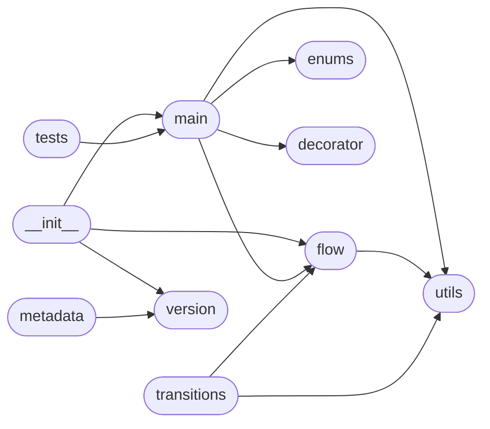

# Code Overview

[_Documentation generated by Documatic_](https://www.documatic.com)

<!---Documatic-section-Codebase Structure Python-start--->
## Codebase Structure Python

The codebase has a flat structure, with 10 code files.

<!---Documatic-block-system_architecture-start--->

<!---Documatic-block-system_architecture-end--->

# #
<!---Documatic-section-Codebase Structure Python-end--->

<!---Documatic-section-Key Objects-start--->
## Key Objects

There are exposed imports at level-0
from the source directory (yeelight)

<!---Documatic-block-yeeligh-start--->

	
<code>yeeligh</code> (Click to Expand!)

* `yeelight.flow.Flow`
* `yeelight.flow.HSVTransition`
* `yeelight.flow.RGBTransition`
* `yeelight.flow.SleepTransition`
* `yeelight.flow.TemperatureTransition`
* `yeelight.main.Bulb`
* `yeelight.main.BulbException`
* `yeelight.main.BulbType`
* `yeelight.main.discover_bulbs`
* `yeelight.version.__version__`

<!---Documatic-block-yeeligh-end--->

# #
<!---Documatic-section-Key Objects-end--->

<!---Documatic-section-Important Functions-start--->
## Important Functions

<!---Documatic-block-important_funcs-start--->
<!---Documatic-block-most_used_funcs-start--->
### Most Utilised Functions

* [yeelight.utils._clamp](3-yeelight_utils.md#yeelight.utils._clamp) (3 times)
* yeelight.version.__version__ (2 times)
* [yeelight.decorator.decorator](6-yeelight_decorator.md#yeelight.decorator.decorator) (1 times)
* [yeelight.main.discover_bulbs](5-yeelight_main.md#yeelight.main.discover_bulbs) (1 times)
<!---Documatic-block-most_used_funcs-end--->

<!---Documatic-block-end_user_funcs-start--->
### End User Exposed Functions

* [yeelight.main.BulbException](5-yeelight_main.md#yeelight.main.BulbException)
* [yeelight.flow.HSVTransition](4-yeelight_flow.md#yeelight.flow.HSVTransition)
* [yeelight.flow.SleepTransition](4-yeelight_flow.md#yeelight.flow.SleepTransition)
* yeelight.version.__version__
* [yeelight.flow.RGBTransition](4-yeelight_flow.md#yeelight.flow.RGBTransition)
* [yeelight.main.BulbType](5-yeelight_main.md#yeelight.main.BulbType)
* [yeelight.main.Bulb](5-yeelight_main.md#yeelight.main.Bulb)
* [yeelight.main.discover_bulbs](5-yeelight_main.md#yeelight.main.discover_bulbs)
* [yeelight.flow.Flow](4-yeelight_flow.md#yeelight.flow.Flow)
* [yeelight.flow.TemperatureTransition](4-yeelight_flow.md#yeelight.flow.TemperatureTransition)
<!---Documatic-block-end_user_funcs-end--->
<!---Documatic-block-important_funcs-end--->

# #
<!---Documatic-section-Important Functions-end--->

<!---Documatic-section-Class Hierarchy-start--->
## Class Hierarchy

<!---Documatic-block-Enum-start--->

	
<code>Enum</code> (Click to Expand!)

* yeelight.enums.CronType
* yeelight.flow.Action
* [yeelight.main.BulbType](5-yeelight_main.md#yeelight.main.BulbType)

<!---Documatic-block-Enum-end--->

<!---Documatic-block-IntEnum-start--->

	
<code>IntEnum</code> (Click to Expand!)

* yeelight.enums.PowerMode

<!---Documatic-block-IntEnum-end--->

<!---Documatic-block-_GeneratorContextManager-start--->

	
<code>_GeneratorContextManager</code> (Click to Expand!)

* yeelight.decorator.ContextManager

<!---Documatic-block-_GeneratorContextManager-end--->

<!---Documatic-block-object-start--->

	
<code>object</code> (Click to Expand!)

* [yeelight.flow.Flow](4-yeelight_flow.md#yeelight.flow.Flow)
* yeelight.flow.FlowTransition

<!---Documatic-block-object-end--->

<!---Documatic-block-yeelight.flow.FlowTransition-start--->

	
<code>yeelight.flow.FlowTransition</code> (Click to Expand!)

* [yeelight.flow.HSVTransition](4-yeelight_flow.md#yeelight.flow.HSVTransition)
* [yeelight.flow.RGBTransition](4-yeelight_flow.md#yeelight.flow.RGBTransition)
* [yeelight.flow.SleepTransition](4-yeelight_flow.md#yeelight.flow.SleepTransition)
* [yeelight.flow.TemperatureTransition](4-yeelight_flow.md#yeelight.flow.TemperatureTransition)

<!---Documatic-block-yeelight.flow.FlowTransition-end--->

# #
<!---Documatic-section-Class Hierarchy-end--->

[_Documentation generated by Documatic_](https://www.documatic.com)