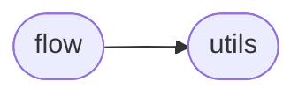

# Yeelight Flow

[_Documentation generated by Documatic_](https://www.documatic.com)

<!---Documatic-section-Codebase Structure-start--->
## Codebase Structure

<!---Documatic-block-system_architecture-start--->

<!---Documatic-block-system_architecture-end--->

# #
<!---Documatic-section-Codebase Structure-end--->

<!---Documatic-section-yeelight.flow.HSVTransition-start--->
## [yeelight.flow.HSVTransition](4-yeelight_flow.md#yeelight.flow.HSVTransition)

<!---Documatic-section-HSVTransition-start--->
<!---Documatic-block-yeelight.flow.HSVTransition-start--->
<details>
	<summary><code>yeelight.flow.HSVTransition</code> code snippet</summary>

```python
class HSVTransition(FlowTransition):

    def __init__(self, hue, saturation, duration=300, brightness=100):
        """
        An HSV transition.

        :param int hue: The color hue to transition to (0-359).
        :param int saturation: The color saturation to transition to (0-100).
        :param int duration: The duration of the effect, in milliseconds. The
                             minimum is 50.
        :param int brightness: The brightness value to transition to (1-100).
        """
        self.hue = hue
        self.saturation = saturation
        self._mode = 1
        self.duration = duration
        self.brightness = brightness

    @property
    def _value(self):
        """The YeeLight-compatible value for this transition."""
        hue = _clamp(self.hue, 0, 359) / 359.0
        saturation = max(0, min(100, self.saturation)) / 100.0
        (red, green, blue) = [int(round(col * 255)) for col in colorsys.hsv_to_rgb(hue, saturation, 1)]
        return red * 65536 + green * 256 + blue

    def __repr__(self):
        return '<%s(%s,%s) duration %s, brightness %s>' % (self.__class__.__name__, self.hue, self.saturation, self.duration, self.brightness)
```
</details>
<!---Documatic-block-yeelight.flow.HSVTransition-end--->
<!---Documatic-section-HSVTransition-end--->

# #
<!---Documatic-section-yeelight.flow.HSVTransition-end--->

<!---Documatic-section-yeelight.flow.SleepTransition-start--->
## [yeelight.flow.SleepTransition](4-yeelight_flow.md#yeelight.flow.SleepTransition)

<!---Documatic-section-SleepTransition-start--->
<!---Documatic-block-yeelight.flow.SleepTransition-start--->
<details>
	<summary><code>yeelight.flow.SleepTransition</code> code snippet</summary>

```python
class SleepTransition(FlowTransition):

    def __init__(self, duration=300):
        """
        A Sleep transition.

        :param int duration: The duration of the effect, in milliseconds. The
                             minimum is 50.
        """
        self._mode = 7
        self._value = 1
        self.brightness = 2
        self.duration = duration

    def __repr__(self):
        return '<%s: duration %s>' % (self.__class__.__name__, self.duration)
```
</details>
<!---Documatic-block-yeelight.flow.SleepTransition-end--->
<!---Documatic-section-SleepTransition-end--->

# #
<!---Documatic-section-yeelight.flow.SleepTransition-end--->

<!---Documatic-section-yeelight.flow.RGBTransition-start--->
## [yeelight.flow.RGBTransition](4-yeelight_flow.md#yeelight.flow.RGBTransition)

<!---Documatic-section-RGBTransition-start--->
<!---Documatic-block-yeelight.flow.RGBTransition-start--->
<details>
	<summary><code>yeelight.flow.RGBTransition</code> code snippet</summary>

```python
class RGBTransition(FlowTransition):

    def __init__(self, red, green, blue, duration=300, brightness=100):
        """
        An RGB transition.

        :param int red: The value of red (0-255).
        :param int green: The value of green (0-255).
        :param int blue: The value of blue (0-255).
        :param int duration: The duration of the effect, in milliseconds. The
                             minimum is 50.
        :param int brightness: The brightness value to transition to (1-100).
        """
        self.red = red
        self.green = green
        self.blue = blue
        self._mode = 1
        self.duration = duration
        self.brightness = brightness

    @property
    def _value(self):
        """The YeeLight-compatible value for this transition."""
        red = _clamp(self.red, 0, 255)
        green = _clamp(self.green, 0, 255)
        blue = _clamp(self.blue, 0, 255)
        return red * 65536 + green * 256 + blue

    def __repr__(self):
        return '<%s(%s,%s,%s) duration %s, brightness %s>' % (self.__class__.__name__, self.red, self.green, self.blue, self.duration, self.brightness)
```
</details>
<!---Documatic-block-yeelight.flow.RGBTransition-end--->
<!---Documatic-section-RGBTransition-end--->

# #
<!---Documatic-section-yeelight.flow.RGBTransition-end--->

<!---Documatic-section-yeelight.flow.Flow-start--->
## [yeelight.flow.Flow](4-yeelight_flow.md#yeelight.flow.Flow)

<!---Documatic-section-Flow-start--->
<!---Documatic-block-yeelight.flow.Flow-start--->
<details>
	<summary><code>yeelight.flow.Flow</code> code snippet</summary>

```python
class Flow(object):
    actions = Action

    def __init__(self, count=0, action=Action.recover, transitions=None):
        """
        A complete flow, consisting of one or multiple transitions.

        Example:

        >>> transitions = [RGBTransition(255, 0, 0), SleepTransition(400)]
        >>> Flow(3, Flow.actions.recover, transitions)

        :param int count: The number of times to run this flow (0 to run
                          forever).
        :param action action: The action to take after the flow stops. Can be
                              ``Flow.actions.recover`` to go back to the state
                              before the flow, ``Flow.actions.stay`` to stay at
                              the last state, and ``Flow.actions.off`` to turn
                              off.
        :param list transitions: A list of :py:class:`FlowTransition
                                 <yeelight.FlowTransition>` instances that
                                 describe the flow transitions to perform.
        """
        if transitions is None:
            transitions = []
        self.count = count
        self.action = action
        self.transitions = transitions
        if len(self.transitions) > 9:
            _LOGGER.warning('The bulb seems to support up to 9 transitions. Your %s might fail.' % len(self.transitions))

    @property
    def expression(self):
        """
        Return a YeeLight-compatible expression that implements this flow.

        :rtype: list
        """
        expr = chain.from_iterable((transition.as_list() for transition in self.transitions))
        expr = ', '.join((str(value) for value in expr))
        return expr
```
</details>
<!---Documatic-block-yeelight.flow.Flow-end--->
<!---Documatic-section-Flow-end--->

# #
<!---Documatic-section-yeelight.flow.Flow-end--->

<!---Documatic-section-yeelight.flow.TemperatureTransition-start--->
## [yeelight.flow.TemperatureTransition](4-yeelight_flow.md#yeelight.flow.TemperatureTransition)

<!---Documatic-section-TemperatureTransition-start--->
<!---Documatic-block-yeelight.flow.TemperatureTransition-start--->
<details>
	<summary><code>yeelight.flow.TemperatureTransition</code> code snippet</summary>

```python
class TemperatureTransition(FlowTransition):

    def __init__(self, degrees, duration=300, brightness=100):
        """
        A Color Temperature transition.

        :param int degrees: The degrees to set the color temperature to
                            (1700-6500).
        :param int duration: The duration of the effect, in milliseconds. The
                             minimum is 50.
        :param int brightness: The brightness value to transition to (1-100).
        """
        self.degrees = degrees
        self._mode = 2
        self.duration = duration
        self.brightness = _clamp(brightness, 1, 100)

    @property
    def _value(self):
        """The YeeLight-compatible value for this transition."""
        return max(1700, min(6500, self.degrees))

    def __repr__(self):
        return '<%s(%sK) duration %s, brightness %s>' % (self.__class__.__name__, self.degrees, self.duration, self.brightness)
```
</details>
<!---Documatic-block-yeelight.flow.TemperatureTransition-end--->
<!---Documatic-section-TemperatureTransition-end--->

# #
<!---Documatic-section-yeelight.flow.TemperatureTransition-end--->

[_Documentation generated by Documatic_](https://www.documatic.com)