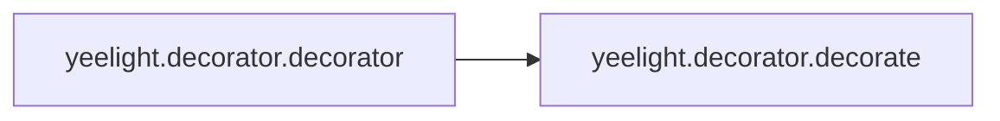

# Yeelight Decorator

[_Documentation generated by Documatic_](https://www.documatic.com)

<!---Documatic-section-Codebase Structure-start--->
## Codebase Structure

<!---Documatic-block-system_architecture-start--->
```mermaid
None
```
<!---Documatic-block-system_architecture-end--->

# #
<!---Documatic-section-Codebase Structure-end--->

<!---Documatic-section-yeelight.decorator.decorator-start--->
## [yeelight.decorator.decorator](6-yeelight_decorator.md#yeelight.decorator.decorator)

<!---Documatic-section-decorator-start--->


### Object Calls

* [yeelight.decorator.decorate](6-yeelight_decorator.md#yeelight.decorator.decorate)

<!---Documatic-block-yeelight.decorator.decorator-start--->
<details>
	<summary><code>yeelight.decorator.decorator</code> code snippet</summary>

```python
def decorator(caller, _func=None):
    if _func is not None:
        return decorate(_func, caller)
    if inspect.isclass(caller):
        name = caller.__name__.lower()
        doc = 'decorator(%s) converts functions/generators into factories of %s objects' % (caller.__name__, caller.__name__)
    elif inspect.isfunction(caller):
        if caller.__name__ == '<lambda>':
            name = '_lambda_'
        else:
            name = caller.__name__
        doc = caller.__doc__
    else:
        name = caller.__class__.__name__.lower()
        doc = caller.__call__.__doc__
    evaldict = dict(_call_=caller, _decorate_=decorate)
    return FunctionMaker.create('%s(func)' % name, 'return _decorate_(func, _call_)', evaldict, doc=doc, module=caller.__module__, __wrapped__=caller)
```
</details>
<!---Documatic-block-yeelight.decorator.decorator-end--->
<!---Documatic-section-decorator-end--->

# #
<!---Documatic-section-yeelight.decorator.decorator-end--->

<!---Documatic-section-yeelight.decorator.decorate-start--->
## [yeelight.decorator.decorate](6-yeelight_decorator.md#yeelight.decorator.decorate)

<!---Documatic-section-decorate-start--->
<!---Documatic-block-yeelight.decorator.decorate-start--->
<details>
	<summary><code>yeelight.decorator.decorate</code> code snippet</summary>

```python
def decorate(func, caller):
    evaldict = dict(_call_=caller, _func_=func)
    fun = FunctionMaker.create(func, 'return _call_(_func_, %(shortsignature)s)', evaldict, __wrapped__=func)
    if hasattr(func, '__qualname__'):
        fun.__qualname__ = func.__qualname__
    return fun
```
</details>
<!---Documatic-block-yeelight.decorator.decorate-end--->
<!---Documatic-section-decorate-end--->

# #
<!---Documatic-section-yeelight.decorator.decorate-end--->

[_Documentation generated by Documatic_](https://www.documatic.com)